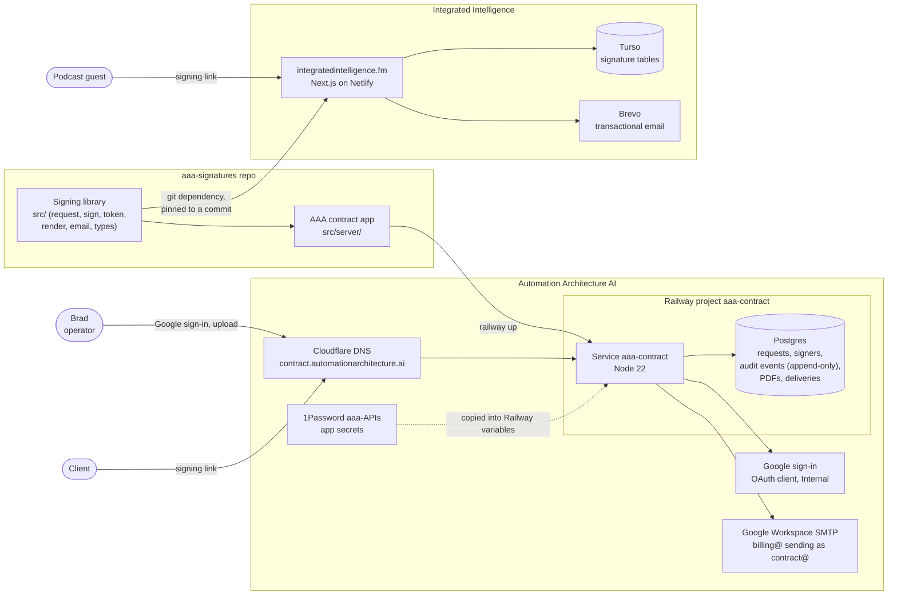

# aaa-signatures

Self-hosted e-signatures for Automation Architecture AI. Signature requests go to a named
person by email, and every step is written to an audit trail built for ESIGN and UETA. It
replaces paying per seat for DocuSign or Dropbox Sign when a lightweight, correctly designed
flow is enough.

This repo holds two things:

| Part | Where | What it is |
|---|---|---|
| **Signing library** | `src/` (except `src/server/`) | `@automation-architecture/signatures`: requests, tokens, signing, audit events, signed record. No UI, no database, no email provider of its own. |
| **AAA contract app** | `src/server/` | The site at **contract.automationarchitecture.ai**. You upload a PDF, the client signs, you countersign, and both parties get the executed PDF. |

The library is also used outside this repo, by the Integrated Intelligence website, for podcast
guest releases. See [Where it's used](#where-its-used).

## Contents

- [Architecture](#architecture)
- [Where it's used](#where-its-used)
- [Sending a contract (AAA)](#sending-a-contract-aaa)
- [Sending a guest release (Integrated Intelligence)](#sending-a-guest-release-integrated-intelligence)
- [Using the library in another app](#using-the-library-in-another-app)
- [The contract app: configuration and operations](#the-contract-app-configuration-and-operations)
- [What this gets you toward ESIGN/UETA](#what-this-gets-you-toward-esignueta)
- [Maintenance notes and things to update](#maintenance-notes-and-things-to-update)
- [Tests](#tests)

## Architecture

The editable diagram is [`docs/architecture.excalidraw`](docs/architecture.excalidraw). Open
it at [excalidraw.com](https://excalidraw.com) (menu, then Open) or with the Excalidraw VS Code
extension. The same structure, rendered by GitHub:



How the pieces relate:

- **The library holds the rules.** It decides who may sign and when, what counts as a
  signature, and what gets audited. It never talks to a database or email service
  directly. Each app supplies a `SignatureStore` (storage) and sends its own email.
- **Each app keeps its own data.** The AAA contract app stores everything in its own Postgres
  database on Railway. Integrated Intelligence stores its signatures in its own Turso database.
  Nothing is shared between organizations except the library code.
- **Consumers pin the library to a commit.** A library change only reaches Integrated
  Intelligence when its dependency is bumped. See
  [Bumping a consumer](#bumping-a-consumer-to-a-new-library-version).

## Where it's used

| Use | Who signs | App and repo | Storage | Email |
|---|---|---|---|---|
| **AAA client contracts** (SOWs, MSAs) | Client, then Brad countersigns, or the reverse | Contract app in this repo, `src/server/` | Postgres on Railway (`aaa-contract`) | Google Workspace SMTP, from `contract@automationarchitecture.ai` |
| **Integrated Intelligence guest releases** | Podcast guest, then the host countersigns | [integrated-intelligence](https://github.com/Automation-Architecture/integrated-intelligence) (`scripts/send-guest-release.ts`, `app/sign/`, `app/api/sign/`) | Turso (`lib/signatures/store.ts`) | Brevo, from the site's reply address |

Both follow the same flow: two signers in a fixed order, a single-use link for each, a
countersign invite once the first signer finishes, and a signed record emailed to both parties
at the end.

## Sending a contract (AAA)

1. Go to **https://contract.automationarchitecture.ai** and click **Sign in with Google**. Only
   `brad@automationarchitecture.ai` is allowed in.
2. Fill in the form:
   - **Contract title:** the name the client sees in the email subject and on the certificate.
   - **Contract PDF:** the final version. It's fingerprinted at upload, so a later change needs
     a new request.
   - **Client signer name and email:** the person's full legal name, and the address they will
     actually open.
   - **Signing order:** client first (the default), or you first.
3. Click **Send for signature**. The client gets an email from
   `contract@automationarchitecture.ai` with a "Review and sign" button.
4. When the client signs, you get a "Please countersign" email. Open it, tick the consent box,
   type your name and sign.
5. Both parties then get "Signed and complete" with the executed PDF attached. That PDF is your
   contract plus a signature certificate page: who signed, when, from what IP, and the
   document's SHA-256 fingerprint.

Each contract's page (click its title in the list) shows:

- **Signers:** status and signing time for each party.
- **Delivery:** whether each party's executed copy was sent, is retrying, or failed.
- **Audit trail:** every sent, viewed and signed event.
- **Downloads:** the original and executed PDFs.

The page also has these actions:

| Action | When to use it |
|---|---|
| **Resend link** | The signer lost the email or the link expired (14 days). A new link replaces the old one. |
| **Void request** | Withdraw a contract. Every link stops working immediately. |
| **Finalize and send** | Shown if both parties signed but the executed PDF was never generated. |
| **Resend executed PDF** | Send the executed copy to both parties again. |

Replies to any contract email land in the `billing@` mailbox, because `contract@` is an alias of
it.

## Sending a guest release (Integrated Intelligence)

From the integrated-intelligence repo, ask Claude to "send the guest release to <name> at
<email>". That runs the repo's `send-guest-release` skill. It wraps:

```bash
npx tsx scripts/send-guest-release.ts --guest-name "Jane Doe" --guest-email jane@example.com
```

The guest gets a signing link at `integratedintelligence.fm/sign/...`. Once they sign, the host
(`hello@integratedintelligence.fm` by default) is invited to countersign automatically, and both
receive the signed record. The release text is `content/legal/guest-release.md`. Full details are
in that repo's `CLAUDE.md` under "Guest-release signing".

## Using the library in another app

### Install

Add it as a git dependency pinned to a commit on `main`:

```json
"@automation-architecture/signatures": "github:Automation-Architecture/aaa-signatures#<commit-sha>"
```

The package builds itself on install (`prepare` runs `tsc`). pnpm 10 and later block that build
unless the package is allowlisted in `pnpm-workspace.yaml`. For a GitHub commit, pnpm checks the
**codeload tarball** key; a `git+https://…` key is silently ignored:

```yaml
allowBuilds:
  "@automation-architecture/signatures@https://codeload.github.com/Automation-Architecture/aaa-signatures/tar.gz/<commit-sha>": true
```

### Wire it up

1. **Storage.** Implement `SignatureStore` (see `src/types.ts`) against the app's own database.
   `schema.sql` is the reference Postgres shape, and `src/adapters/supabase.ts` is a reference
   Supabase implementation to copy. Two rules matter:
   - `updateSigner` must save **every** field it's given, including `tokenHash` and
     `tokenExpiresAt`. `issueSignerToken` rotates countersign links through it, and a store that
     drops those fields breaks every countersign link. Integrated Intelligence had exactly this
     bug until #27 there.
   - When the patch sets `status: "signed"`, the update must be conditional: `where id = ? and
     status = 'pending'`. If no row changes, throw `SigningError("already_signed")`. That's what
     stops a double-submitted form from recording two signatures.
2. **Make the audit table append-only.** The app role must not be able to update or delete
   audit rows. If the role owns the table, a `REVOKE` won't bind it, so use a trigger. There are
   examples in `schema.sql` and `src/server/store.ts`.
3. **Email.** Send invites and completion messages however the app already sends mail.
   `inviteEmail` and `completedEmail` in `src/email.ts` are plain templates. `BrevoEmailSender`
   is there for apps on Brevo.
4. **Pages.** The signing page is the app's own UI. It must:
   - On **GET**, call `getSigningView` only. That records a `viewed` event and never signs. Mail
     scanners (Safe Links, Proofpoint, Mimecast) open links to inspect them, so viewing must not
     count as signing.
   - Show the consent disclosure, require a ticked checkbox and a typed legal name, and echo
     back the document fingerprint it displayed.
   - On **POST**, call `captureSignature`. If it returns `nextSigner`, call `issueSignerToken`
     and email that signer. If it returns `completed`, send the signed record
     (`renderSignedRecord` for an HTML record) to everyone.

### The flow in code

```ts
const { request, rawTokens } = await createSignatureRequest(store, { title, documentHtml, signers });
const first = request.signers.find((s) => s.order === 0)!;
const firstToken = rawTokens.get(first.id)!;  // only the hash is stored; email this now
// email `first` a link like /sign/<request.id>/<first.id>?token=<firstToken>

await getSigningView(store, { requestId, signerId, token, ip, userAgent });            // GET
const { completed, nextSigner } = await captureSignature(store, {                      // POST
  requestId, signerId, token, typedLegalName, agreedToElectronicSignature: true, documentSha256Seen,
});
if (nextSigner) { const fresh = await issueSignerToken(store, requestId, nextSigner.id); /* email it */ }
if (completed) { /* send the signed record to every signer */ }
```

### Why it's non-embedded

An earlier attempt (integrated-intelligence PR #19, closed) put signing behind a public form
that accepted any name and email. Anyone could then produce a "signed" document in someone
else's name, and the audit trail would make the forgery look legitimate. This library only
creates a request for a specific named recipient, and only when an authenticated operator asks.
The recipient's identity comes from delivery to the address the sender chose. The link carries
it, and the signer never types in who they are.

### Bumping a consumer to a new library version

1. Take the commit SHA of `main` in this repo.
2. In the consumer, update both the dependency's `#<sha>` and the `allowBuilds` key, then run
   the install.
3. Check the lockfile diff. Integrated Intelligence pins `next`, `react` and friends to `latest`,
   so any lockfile rewrite also upgrades them. Call that out in the PR.
4. Run the consumer's type-check, build and `pnpm test`, and let the Netlify deploy preview build
   before merging.

## The contract app: configuration and operations

### Where it runs

| Piece | Where |
|---|---|
| App and database | Railway workspace `aaa_client_projects`, project `aaa-contract`: service `aaa-contract` plus a `Postgres` service |
| Domain | Cloudflare zone `automationarchitecture.ai`: CNAME `contract` to Railway, plus a `_railway-verify.contract` TXT record |
| Admin sign-in | Google OAuth web client in the same Google Cloud project as invoices, redirect `<BASE_URL>/auth/google/callback` |
| Email | Google Workspace SMTP, signed in as `billing@automationarchitecture.ai`, sending as `contract@` (an alias) |
| Secrets | 1Password vault `aaa-APIs`: "Google Cloud OAuth", "aaa-signatures app password", and "aaa-contract admin" (a fallback password) |

### Environment

| Variable | Purpose |
|---|---|
| `DATABASE_URL` | Postgres connection. On Railway this references the Postgres service. |
| `BASE_URL` | Public origin used in emailed links. |
| `SESSION_SECRET` | Signs session and OAuth-state cookies. |
| `GOOGLE_CLIENT_ID`, `GOOGLE_CLIENT_SECRET` | Google sign-in. When both are set, password sign-in is off. |
| `ALLOWED_EMAILS` | Comma-separated admin allowlist. Default `brad@automationarchitecture.ai`. |
| `ADMIN_PASSWORD` | Fallback login, used only while Google sign-in isn't configured. |
| `SMTP_HOST`, `SMTP_PORT`, `SMTP_USER`, `SMTP_PASSWORD` | Outgoing mail. `SMTP_PASSWORD` is a Google app password, not the account password. |
| `EMAIL_FROM_EMAIL`, `EMAIL_FROM_NAME` | Sender shown on every email. |
| `ADMIN_SIGNER_NAME`, `ADMIN_SIGNER_EMAIL` | The countersigner on every contract. |
| `EMAIL_DEV_LOG` | Local only. `1` logs emails instead of sending them, even when SMTP is configured. |

`.env.example` lists them all.

### Run locally

```bash
cp .env.example .env        # point DATABASE_URL at a local Postgres; set EMAIL_DEV_LOG=1
npm install
npm run dev                 # runs src/server/main.ts directly with Node's type stripping
```

The schema is created or migrated automatically at startup.

### Deploy

Deploys are manual. The Railway service is **not** connected to this GitHub repo. From a fresh
checkout of `main`:

```bash
railway link --workspace aaa_client_projects --project aaa-contract --environment production --service aaa-contract
railway up --service aaa-contract
```

Railway builds with `npm run build` and starts with `npm start`. Afterwards, check
`https://contract.automationarchitecture.ai/healthz` returns `ok`.

### How it behaves when things go wrong

- **Email fails at completion.** Each party's copy is tracked. A background job retries with
  backoff (2 minutes, doubling to a 6-hour cap, 10 attempts). The contract page shows each copy
  as sent, retrying or failed.
- **Executed PDF can't be built.** The signer still sees that their signature is recorded. The
  contract page shows a warning and **Finalize and send**. Uploads are test-processed first, so a
  PDF that would break this is refused before anyone signs.
- **Two finalizations at once.** A lease row in the database lets only one run per contract,
  across every server instance. Only one executed PDF can ever be stored, so both parties always
  get identical bytes.
- **Double-clicked Sign button.** Records one signature; the second submit gets "already
  signed".
- **Audit trail.** Database triggers refuse every update, delete and truncate on the audit
  table.

## What this gets you toward ESIGN/UETA

U.S. federal (ESIGN) and state (UETA) law don't require a particular vendor. They require
certain things to be true of the process:

| Requirement | How it's handled |
|---|---|
| Consent to electronic records | The signing page shows a disclosure and the signer must tick it. `captureSignature` rejects a missing consent. |
| Intent to sign | A typed full legal name, not only a checkbox. |
| Attribution to the signer | A single-use, expiring token delivered only to the address the sender chose, verified in constant time, plus a strict signing order. |
| Association with the record | The document's SHA-256 is fixed at creation and re-checked at signing. A changed document is refused. |
| Audit trail | `sent`, `viewed` and `signed` events with time, IP and user agent, in an append-only table. |
| Retention | Every party receives the signed record by email, so retention doesn't depend on this system staying up. |

**What it doesn't give you:** a vendor's legal indemnification, a trusted third-party timestamp,
or case law showing the process holds up in a dispute. For guest releases that gap matters
little. **For client contracts, have counsel review the consent disclosure and this design
once.** That review hasn't happened yet (see below).

## Maintenance notes and things to update

Dependency and configuration check, done on 2026-09-27.

### Dependencies

| Package | Where | In use | Latest | Note |
|---|---|---|---|---|
| `pg` | contract app | 8.23 | 8.23 | Current. |
| `nodemailer` | contract app | 10.0 | 10.0 | Current. |
| `pdf-lib` | contract app | 1.17.1 | 1.17.1 | Current, but unmaintained since 2021. Fine for appending a page. |
| `typescript` | build | 5.9 | 7.0 | Two majors behind. Build-time only. Upgrade deliberately and rebuild. |
| `@types/node` | build | 22 | 26 | Matches the Node 22 runtime on Railway. Keep it aligned with the runtime, not with latest. |

`npm audit` reports no known vulnerabilities in runtime dependencies. Integrated Intelligence
runs this library at commit `0b94586`, current as of this check. Its own packages (`next`,
`react`, `typescript`) are pinned to `latest`.

### Should be updated

1. **The library package carries the contract app's dependencies.** `pg`, `nodemailer` and
   `pdf-lib` are listed as dependencies of `@automation-architecture/signatures`, so every
   consumer installs them even though only `src/server/` uses them. The build also compiles
   `src/server/` into the published `dist/`. The fix is to split the app into its own package,
   for example with npm workspaces, so the library stays dependency-free.
2. **Deploys are manual.** Nothing stops `main` and production from drifting apart. Connect the
   Railway service to this repo so merges to `main` deploy, or add a deploy step to CI.
3. **No CI runs the tests.** `npm test` only runs locally. Add a GitHub Actions workflow that
   runs `npm ci`, `npm run build` and `npm test` on every PR. The contract app itself has no
   automated tests; its failure handling was verified by hand.
4. **Integrated Intelligence doesn't retry completion emails.** If Brevo fails when the last
   party signs, the signature is recorded, the request errors and nobody is told. The contract
   app solved this with tracked, retried deliveries. That logic lives in `src/server/`, not the
   library, so the site doesn't get it. Either move delivery tracking into the library or port
   it.
5. **Integrated Intelligence's audit table is append-only by convention only.** Its
   `lib/signatures/schema.sql` relies on the code never issuing `UPDATE` or `DELETE`. SQLite
   and Turso support triggers, so the same protection used here can be added there.
6. **Integrated Intelligence pins everything to `latest`.** Any lockfile change silently upgrades
   Next.js and React. Pin to version ranges (for example `^16.3.6`) so upgrades are deliberate.
7. **Neither app pins its Node version.** Railway currently builds on Node 22.23 and Netlify on
   its default. The library needs Node 22 or later. Add `engines` or `.nvmrc` to Integrated
   Intelligence, and pin the Railway build to Node 22.
8. **The consent disclosure hasn't had legal review.** Recommended before relying on this for
   client contracts with real dispute risk.
9. **Old Integrated Intelligence countersign links.** Guest releases where the guest signed before
   2026-09-26 were sent countersign links that never worked. If any are still waiting, the
   guest needs to sign again, or a "reissue countersign link" action needs adding there.

## Tests

```bash
npm test
```

The library tests cover:

- **Viewing never signs.** Opening a link doesn't record a signature.
- **Signing order.** A countersigner can't sign before the first signer.
- **Bad input.** A wrong token, a changed document and a missing consent are all refused.
- **Token rotation.** A countersign token minted after the first signer finishes works.
- **Concurrency.** Two simultaneous submissions record one signature.
- **Happy path.** The full two-signer flow completes and renders the signed record.

Integrated Intelligence runs its own `pnpm test` against its real store. It covers concurrent
submits and countersign-token rotation.
